# Hướng dẫn sử dụng vad-eval

Bộ công cụ đánh giá output của model VAD (YAMNet, cửa sổ 0.96 s, hop 0.08 s) so với nhãn 0.5 s, gồm cả phần hậu xử lý
và so sánh các phương án hậu xử lý. Tài liệu đi lần lượt từng phần, theo đúng thứ tự thường dùng.

Mục lục

1. [Tổng quan](#1-tổng-quan)
2. [Cài đặt](#2-cài-đặt)
3. [Chuẩn bị dữ liệu](#3-chuẩn-bị-dữ-liệu)
4. [Phần 1 – Gán nhãn tự động: `auto_label.py`](#4-phần-1--gán-nhãn-tự-động-auto_labelpy)
5. [Phần 2 – Đánh giá: `evaluate_real.py`](#5-phần-2--đánh-giá-evaluate_realpy)
6. [Phần 3 – Tinh chỉnh và so sánh hậu xử lý](#6-phần-3--tinh-chỉnh-và-so-sánh-hậu-xử-lý)
7. [Phần 4 – Xuất Excel: `make_excel_real.py`](#7-phần-4--xuất-excel-make_excel_realpy)
8. [Phần 5 – Demo dữ liệu giả định: `gen_data.py`, `evaluate.py`, `make_excel.py`](#8-phần-5--demo-dữ-liệu-giả-định)
9. [Phần 6 – Dùng `vadlib.py` trong code của bạn](#9-phần-6--dùng-vadlibpy-trong-code)
10. [Quy trình gợi ý từ đầu đến cuối](#10-quy-trình-gợi-ý-từ-đầu-đến-cuối)
11. [Lỗi thường gặp](#11-lỗi-thường-gặp)

---

## 1. Tổng quan

| File | Vai trò | Khi nào dùng |
|---|---|---|
| `auto_label.py` | Gán nhãn speech / non-speech tự động bằng FireRedVAD (+ Silero đối chiếu), xuất danh sách đoạn cần nghe lại | Khi chưa có nhãn, hoặc cần người gán thứ 2 |
| `evaluate_real.py` | Đánh giá chính: kiểm tra dữ liệu, AUC, chọn ngưỡng, MR / FAR / F1 / DCF, ablation, so sánh hậu xử lý | Mỗi khi có output model mới hoặc đổi cấu hình hậu xử lý |
| `make_excel_real.py` | Đổ kết quả của `evaluate_real.py` vào template Excel (chỉ số là công thức) | Khi cần báo cáo Excel |
| `vadlib.py` | Thư viện chung: đọc file, rescore, ngưỡng, hậu xử lý, metric | Được các script trên import; dùng được trong code riêng |
| `gen_data.py`, `evaluate.py`, `make_excel.py` | Demo trên dữ liệu giả định 10 s | Học quy trình, thử code |
| `vad_post_processing.md` | Mô tả các bước hậu xử lý (Rebin, threshold, padding, drop, merge) | Tham khảo |
| `docs/make_figures.py` | Vẽ lại các sơ đồ / hình minh hoạ của tài liệu này vào `docs/img/` | Khi sửa tài liệu hoặc đổi hàm hậu xử lý |

Luồng dữ liệu:

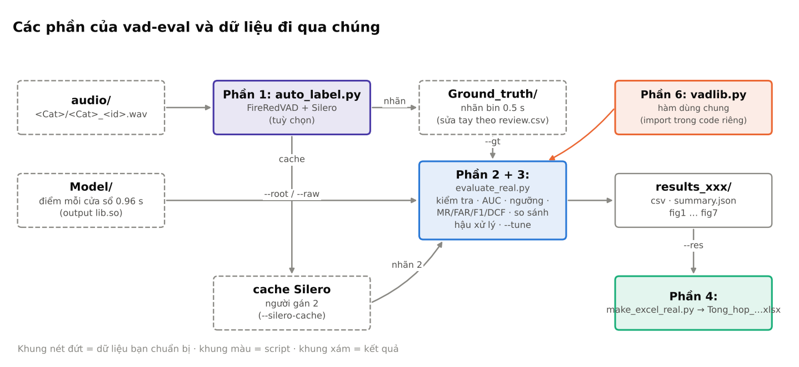

> Các sơ đồ và hình minh hoạ trong tài liệu này được vẽ bằng `python docs/make_figures.py` (hình hậu xử lý dùng đúng
> các hàm của `vadlib.py`). Ảnh chụp Excel và các hình `docs/img/vi_du/` lấy từ một lần chạy trên dữ liệu giả định
> của `gen_data.py`, nên con số chỉ để minh hoạ.

---

## 2. Cài đặt

Python 3.10 trở lên.

```bash
pip install numpy pandas scikit-learn scipy matplotlib openpyxl soundfile
pip install optuna                     # tuỳ chọn: tìm cấu hình hậu xử lý bằng TPE (--tune); không có thì tìm ngẫu nhiên
```

Chỉ cần cho `auto_label.py`:

```bash
pip install fireredvad silero-vad huggingface_hub
python -c "from huggingface_hub import snapshot_download; snapshot_download('FireRedTeam/FireRedVAD', local_dir='pretrained_models/FireRedVAD')"
```

Mọi lệnh dưới đây chạy trong thư mục gốc của repo.

---

## 3. Chuẩn bị dữ liệu

### 3.1 Cấu trúc thư mục

```
<root>/
  Model/<Cat>_<id>.txt                                   output model (bắt buộc)
  audio/<Cat>/<Cat>_<id>.wav                             audio (tuỳ chọn, để kiểm tra thời lượng)
  Ground_truth/<Cat>/groundtruth/Gt_<cat>_<id>.txt        nhãn (bắt buộc)
```

- Tên thư mục không phân biệt hoa thường; `Ground_truth`, `groundtruth`, `GT`, `labels` đều được nhận.
  Model: `Model`, `models`, `raw`. Audio: `audio`, `audios`, `wav`.
- Thư mục có thể nằm sâu bên trong `<root>`; script chọn thư mục nông nhất khớp tên.
- Nếu thư mục nằm chỗ khác, chỉ rõ bằng `--raw`, `--gt`, `--audio` thay cho `--root`.

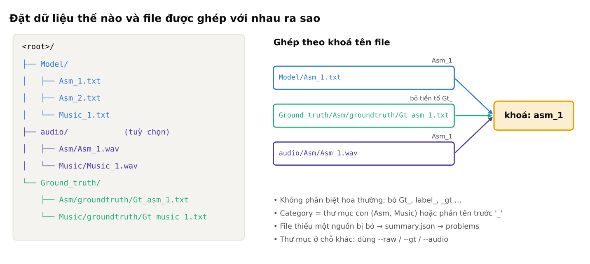

### 3.2 Ghép file

Ba nguồn được ghép theo tên file, không phân biệt hoa thường, bỏ tiền tố / hậu tố nhãn (`Gt_`, `label_`, `_gt`...).
Ví dụ `Model/Asm_1.txt` ↔ `Ground_truth/Asm/groundtruth/Gt_asm_1.txt` ↔ `audio/Asm/Asm_1.wav`.

File thiếu một trong các nguồn bị bỏ và được liệt kê trong `summary.json` → `problems`.
Hai file cùng khoá trong một nguồn cũng bị bỏ (không biết ghép file nào).

### 3.3 Định dạng file

**Output model** — mỗi cửa sổ 0.96 s một dòng, `start` là đầu cửa sổ (giây). Hai dạng đều đọc được, phân cách bằng
phẩy, dấu cách hoặc chấm phẩy:

```
0, 0.00, 0.96, 0.031          # idx, start, end, score
0.08 1.04 0.045               # start end score
```

Output model và nhãn nằm trên hai lưới thời gian khác nhau. Toàn bộ phần hậu xử lý là để chuyển từ lưới của model
(cửa sổ 0.96 s, hop 0.08 s) sang lưới của nhãn (bin 0.5 s):

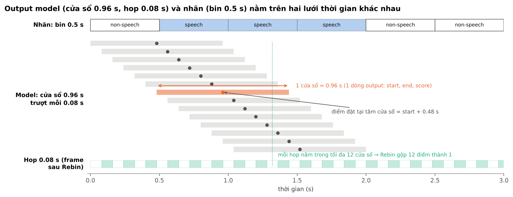

**Nhãn** — mỗi dòng `start end nhãn`, theo bin 0.5 s hoặc theo thời điểm bất kỳ:

```
0.0	0.5	non-speech
0.5	1.0	speech
```

- Nhãn chữ: `speech` / `sp` / `1` là speech; `non-speech`, `nonspeech`, `non speech`, `ns`, `silence`, `noise`, `0` là non-speech.
- Nhãn theo thời điểm được đổi sang bin 0.5 s: bin là speech khi ≥ 50% thời lượng bin là speech.
- Quy tắc gán nhãn đang dùng: hát, rap, ngâm thơ, đọc thơ, đồng ca = speech; nhạc không lời, babble không nghe rõ, cười,
  ho, hắt hơi = non-speech.

**Category** (nhóm dùng để chia dev/test và báo cáo, `--group auto`): ưu tiên thư mục con trong `Model/`, rồi thư mục
con của audio / nhãn, rồi phần tên trước dấu `_`. Nhóm chỉ có 1 file được gộp vào "Khác".

---

## 4. Phần 1 – Gán nhãn tự động: `auto_label.py`

Dùng khi chưa có nhãn tay, hoặc để có người gán thứ 2 (Silero) cho phần nhất quán nhãn của `evaluate_real.py`.

### 4.1 Chạy

```bash
python auto_label.py                              # toàn bộ data/audio/<Cat>/*.wav
python auto_label.py -c Babble Music --limit 3    # thử trên 3 file mỗi category
python auto_label.py --speech-thr 0.5             # đổi ngưỡng: dùng lại cache, không chạy lại model
```

### 4.2 Tham số

| Tham số | Mặc định | Ý nghĩa |
|---|---|---|
| `-a, --audio` | `data/audio` | Thư mục audio, dạng `<Cat>/*.wav` |
| `-o, --out` | `data/auto_labels` | Thư mục kết quả |
| `-c, --categories` | tất cả | Chỉ chạy các category này |
| `--limit N` | 0 | Tối đa N file mỗi category (0 = không giới hạn) |
| `--speech-thr` / `--singing-thr` / `--music-thr` | 0.4 / 0.5 / 0.5 | Ngưỡng xác suất AED cho speech / singing / music |
| `--silero-thr` | 0.5 | Ngưỡng Silero |
| `--suspect-thr` | 0.2 | File Babble: xác suất speech ≥ ngưỡng này bị đánh dấu nghi ngờ |
| `--margin` | 0.1 | Bin có \|p_speech − speech_thr\| < margin bị đánh dấu "không chắc" |
| `--no-silero` | | Không chạy Silero |
| `--gpu` | | Chạy model trên GPU |
| `--force` | | Bỏ cache, chạy lại model |

### 4.3 Kết quả

| File | Nội dung |
|---|---|
| `Groundtruth/<Cat>/groundtruth/Gt_<cat>_<id>.txt` | Nhãn bin 0.5 s, đúng định dạng `evaluate_real.py` đọc |
| `review.csv` | Đoạn cần nghe lại, có độ ưu tiên (`prio 1`: babble có speech, speech kèm singing, lệch Silero; `prio 2`: Silero nghe ra hát, Silero bỏ sót thì thầm, AED sát ngưỡng) |
| `summary.csv` | Thống kê theo file |
| `cache/*.npz` | Xác suất theo frame; dùng cho `--silero-cache` của `evaluate_real.py` |

Nghe lại các đoạn trong `review.csv` (bắt đầu từ `prio 1`) và sửa nhãn trước khi dùng làm nhãn chính.

---

## 5. Phần 2 – Đánh giá: `evaluate_real.py`

### 5.1 Lệnh cơ bản

```bash
python evaluate_real.py --root "C:/Users/leuhu/OneDrive/Máy tính/test" --out results_test
```

Mỗi bộ dữ liệu / mỗi cấu hình nên ghi vào một thư mục `--out` riêng để không đè nhau.
Xem toàn bộ tham số: `python evaluate_real.py --help`.

### 5.2 Script làm gì (theo thứ tự)

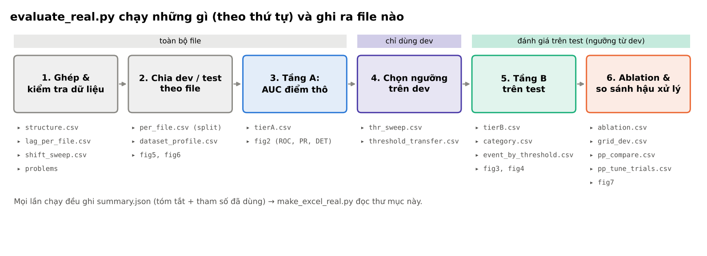

| Mục | Nội dung | Output chính |
|---|---|---|
| 5a | Ghép file model ↔ nhãn ↔ audio | `summary.json` → `problems` |
| 5b–5d | Kiểm tra cấu trúc: hop 0.08, cửa sổ 0.96, điểm trong [0, 1], số cửa sổ khớp thời lượng audio, audio 16 kHz mono | `structure.csv` (cột `flag`) |
| 5e | Căn chỉnh thời gian: quét độ dịch điểm ±0.96 s, lag từng file | `shift_sweep.csv`, `lag_per_file.csv` |
| 1 | Phân bố: tỉ lệ speech, số lần chuyển trạng thái, AUC từng file | `per_file.csv` |
| 2 | Chia dev/test theo file, phân tầng theo category (`--dev-frac`, `--seed`) | cột `split` trong `per_file.csv` |
| 2b | Đặc trưng tập theo độ phân giải model: độ dài đoạn / khoảng lặng so với 0.96 s, cửa sổ lẫn, trần oracle | `dataset_profile.csv`, `seg_gap_hist.csv`, `window_frac_hist.csv`, fig5, fig6 |
| 3 | Nhất quán nhãn với người gán 2 (Cohen κ, κ ở biên / trong đoạn) | `label_agreement.csv` |
| 4 | Độ khó: % bin có điểm mơ hồ, độ nhạy F1 theo ngưỡng | `summary.json` |
| Tầng A | Điểm thô: AUC (micro, macro, bỏ biên, chỉ biên), PR-AUC, TPR@FPR, Brier, CI bootstrap | `tierA.csv`, fig2 |
| Chọn ngưỡng | Quét ngưỡng trên dev cho A0–A4 theo `--criterion` | `thr_sweep.csv`, `threshold_transfer.csv` |
| Tầng B | Trên test ở ngưỡng đã chọn: strict, bỏ bin biên, chỉ bin biên; loại lỗi FEC / MSC / OVER / NDS; event-F1; Δ biên | `tierB.csv`, `event_by_threshold.csv`, fig3 |
| Category | Kết quả test theo category, kèm CI | `category.csv` |
| Ablation | A0–A4, mỗi cấu hình một ngưỡng riêng; lưới pad × merge trên dev | `ablation.csv`, `grid_dev.csv` |
| 6 | So sánh phương án hậu xử lý (xem phần 3) | `pp_compare*.csv`, fig7 |
| Nhãn đáng ngờ | Đoạn điểm và nhãn trái ngược mạnh, không sát biên | `suspicious.csv` |

Các cấu hình A0–A4:

| Mã | Pipeline |
|---|---|
| A0 | Điểm bin thô (trung bình các cửa sổ có tâm trong bin) ≥ ngưỡng, không hậu xử lý |
| A1 | Rescore điểm mỗi hop 0.08 s (gộp cửa sổ + làm mượt) → ngưỡng → rebin 0.5 s |
| A2 | A1 + pad |
| A3 | A1 + merge |
| A4 | Cấu hình đầy đủ: pad + drop + merge, theo thứ tự `--order` — đây là cấu hình dùng cho tầng B và category |

Hậu xử lý A4 trên một file mẫu, từng bước (cấu hình đề xuất, thứ tự merge → drop → pad):

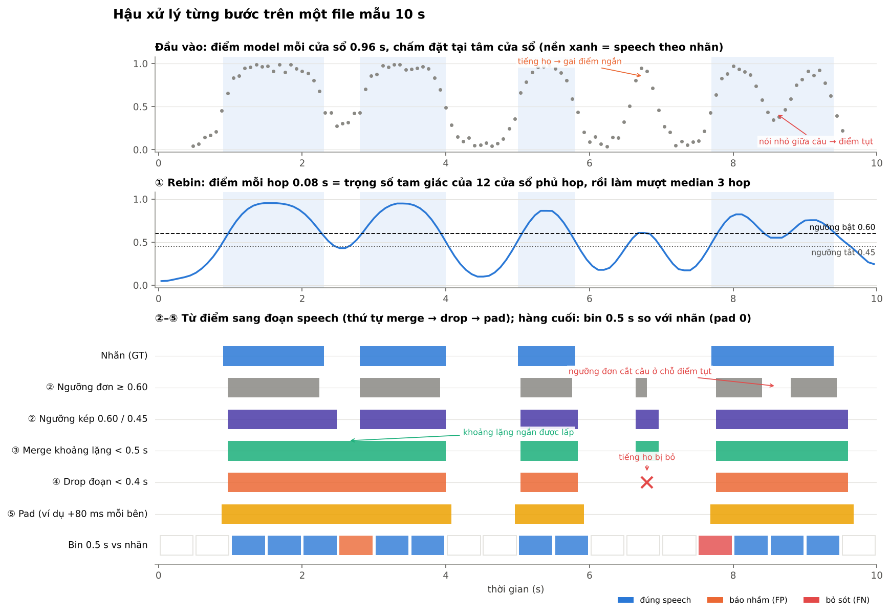

Cách đọc hình:
- Hàng trên: điểm model mỗi cửa sổ. Tiếng ho (6.7 s) tạo một gai điểm; đoạn nói nhỏ (8.6 s) làm điểm tụt.
- Hàng giữa (① Rebin): 12 cửa sổ phủ mỗi hop 0.08 s được gộp bằng trọng số tam giác rồi làm mượt.
- Hàng dưới, đọc từ trên xuống:
  - ② Ngưỡng đơn cắt đôi câu cuối ở chỗ điểm tụt; ngưỡng kép (bật 0.60, tắt 0.45) giữ câu liền.
  - ③ Merge lấp khoảng ngắt hơi < 0.5 s giữa hai câu đầu.
  - ④ Drop bỏ đoạn ngắn do tiếng ho.
  - ⑤ Pad nới hai đầu đoạn (cấu hình đề xuất dùng pad 0; hình dùng +80 ms để thấy rõ).
  - Hàng cuối: bin 0.5 s so với nhãn. Ô cam (báo nhầm) và ô đỏ (bỏ sót) đều nằm sát biên đoạn.
- Lưu ý: cửa sổ 0.96 s làm một gai điểm ngắn trải ra 0.3–0.5 s sau Rebin, nhất là khi dùng ngưỡng kép. Vì vậy nên
  tune `--drop` (0.32–0.5 s) trên dev thay vì dùng một giá trị cố định.

### 5.3 Tham số

**Dữ liệu**

| Tham số | Mặc định | Ý nghĩa |
|---|---|---|
| `--root` | | Thư mục bộ dữ liệu; tự tìm `Model/`, `audio/`, `Ground_truth/` |
| `--raw`, `--gt`, `--audio` | trong `--root` | Chỉ rõ từng thư mục |
| `--out` | `results_real` | Thư mục kết quả |
| `--group auto\|quality\|category\|prefix\|none` | auto | Cách xác định category (mục 3.3) |
| `--label2` | | Nhãn người gán 2, cùng định dạng → nhất quán nhãn, bin "nhãn chắc" |
| `--silero-cache` | | Thư mục `cache/` của `auto_label.py` → Silero làm người gán 2 (khi không có `--label2`) |
| `--gt-alt` | | Nhãn theo quy tắc khác (vd hát = non-speech) → thêm bảng tầng A phụ |
| `--synth-gt` | | Nhãn của các file `syn_val_*` trong `Model/` → chọn ngưỡng trên val tổng hợp |
| `--mo-ta-nhan`, `--mo-ta-model` | | Mô tả ghi vào báo cáo |
| `--dev-frac` | 0.3 | Tỉ lệ file vào dev |
| `--seed` | 3 | Seed chia dev/test |

**Hậu xử lý (A1–A4)** — mặc định là cấu hình hiện tại

| Tham số | Mặc định | Ý nghĩa |
|---|---|---|
| `--preset hien-tai\|de-xuat` | hien-tai | `de-xuat`: median 3 hop, ngưỡng kép Δ 0.15, merge → drop 0.32 s → pad 0/0. Tham số ghi rõ vẫn ghi đè preset |
| `--overlap tri\|hann\|mean\|max\|median\|nearest` | tri | Cách gộp điểm các cửa sổ chồng nhau thành điểm mỗi hop |
| `--domain prob\|logit` | prob | Gộp tri / hann / mean trên xác suất hay log-odds |
| `--smooth N` | 5 | Làm mượt N hop; 1 = không |
| `--smooth-kind mean\|median\|gauss` | mean | Kiểu làm mượt |
| `--hyst D` | 0 | Ngưỡng kép: bật khi điểm ≥ ngưỡng, tắt khi < ngưỡng − D; 0 = ngưỡng đơn |
| `--order pdm\|mdp` | pdm | pdm = pad → drop → merge; mdp = merge → drop → pad |
| `--pad-pre`, `--pad-post` | 0.10, 0.12 | Nới đầu / cuối đoạn (giây); âm = co |
| `--merge-gap` | 0.50 | Gộp hai đoạn cách nhau < N giây |
| `--drop` | 0 | Bỏ đoạn ngắn hơn N giây (pdm: đo sau pad; mdp: đo trước pad) |

**Chọn ngưỡng và thống kê**

| Tham số | Mặc định | Ý nghĩa |
|---|---|---|
| `--criterion DCF-min\|F1-max` | DCF-min | Tiêu chí chọn ngưỡng trên dev |
| `--dcf-miss` | 0.75 | Trọng số miss trong DCF = w·MR + (1 − w)·FAR |
| `--thr-min`, `--thr-max`, `--thr-step` | 0.01, 0.95, 0.01 | Dải quét ngưỡng |
| `--grid-pre`, `--grid-post`, `--grid-gap` | 0,50,100,200 / 0,60,120,240 / 0,250,…,1500 | Lưới pad × merge (ms) quét trên dev |
| `--n-boot` | 1000 | Số lần bootstrap cho CI |

**So sánh hậu xử lý**: `--no-compare`, `--tune N`, `--tune-seed` — xem phần 3.

Mọi tham số đã dùng được lưu trong `summary.json` → `meta.params` và ghi lại vào Excel.

### 5.4 Ví dụ hay dùng

```bash
# có người gán 2 và nhãn quy tắc khác
python evaluate_real.py --root <root> --out results_test --label2 <thư mục nhãn 2> --gt-alt <nhãn hát = non-speech>

# chọn ngưỡng theo F1 thay vì DCF, miss nặng hơn
python evaluate_real.py --root <root> --out results_f1 --criterion F1-max
python evaluate_real.py --root <root> --out results_miss09 --dcf-miss 0.9

# chạy nhanh để thử (ít bootstrap, bỏ phần so sánh)
python evaluate_real.py --root <root> --out results_thu --n-boot 200 --no-compare
```

### 5.5 Đọc kết quả

Sau khi chạy, màn hình in tóm tắt và các bảng chính. Nên xem theo thứ tự:

1. **Kiểm tra dữ liệu trước khi tin số**
   - `summary.json` → `problems`: file không ghép được.
   - `structure.csv`: dòng có `flag = True` (sai hop, sai số cửa sổ, điểm ngoài [0, 1]...).
   - `lag_per_file.csv`: file có `flag = "Lệch ~1 bin"` (lệch ≥ 0.4 s) cần kiểm tra timestamp.
   - `suspicious.csv`: nghe lại các đoạn dài nhất; nhiều đoạn ở đây thường là nhãn sai.
2. **Khả năng phân biệt của model**: `tierA.csv` → `AUC_micro` của "Test (tất cả)" và từng category; `AUC_khong_bien`
   cho biết model tốt thế nào khi bỏ bin sát biên.
3. **Kết quả ở điểm vận hành**: `tierB.csv` (MR, FAR, F1, DCF), `category.csv` (theo category, có CI).
   Lỗi biên (FEC, OVER) là lệch ≤ 1 bin quanh chuyển trạng thái; lỗi thật (MSC, NDS) mới là chỗ cần cải thiện.
4. **Ngưỡng có chuyển được không**: `threshold_transfer.csv` so ngưỡng chọn ở các nơi khác nhau khi áp lên test.
5. **Hậu xử lý giúp hay hại**: `ablation.csv` (A0 → A4) và `pp_compare.csv` (phần 3).
6. **Giới hạn do độ phân giải**: `dataset_profile.csv` → `oracle_A4_F1` là F1 của model hoàn hảo cùng cửa sổ 0.96 s qua hậu
   xử lý hiện tại. Khoảng cách từ F1 thật tới con số này mới là phần model còn cải thiện được.

Cách phân loại lỗi trong tầng B và category (cột FEC, MSC, OVER, NDS):

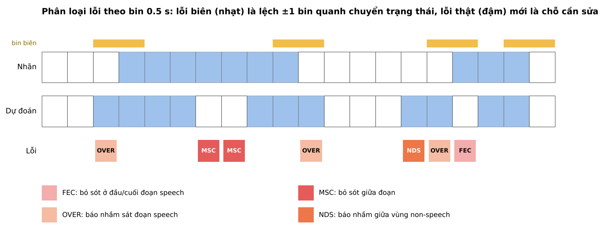

Hình:

| Hình | Nội dung |
|---|---|
| `fig1_kiem_tra_du_lieu.png` | Tỉ lệ speech, AUC từng file, ΔAUC theo độ dịch, lag, phân bố điểm, nhất quán nhãn |
| `fig2_tang_A.png` | ROC, Precision–Recall, DET theo category (test) |
| `fig3_tang_B.png` | MR / FAR theo ngưỡng, loại lỗi theo category, độ lệch biên, DCF theo pad × merge |
| `fig4_timeline.png` | Timeline mẫu: nhãn, điểm, dự đoán |
| `fig5_dac_trung_tap.png`, `fig6_do_dai_doan.png` | Đặc trưng tập; cách đọc chi tiết ở README |
| `fig7_so_sanh_hau_xu_ly.png` | ΔF1, ΔDCF của từng phương án hậu xử lý so với B0 |

Ví dụ các hình (dữ liệu giả định; bấm vào để xem cỡ lớn):

**Hình 1 – Kiểm tra dữ liệu.** Xem file có AUC thấp bất thường (1d), độ dịch làm AUC tăng (5e) và lag từng file
trước khi tin các con số khác.

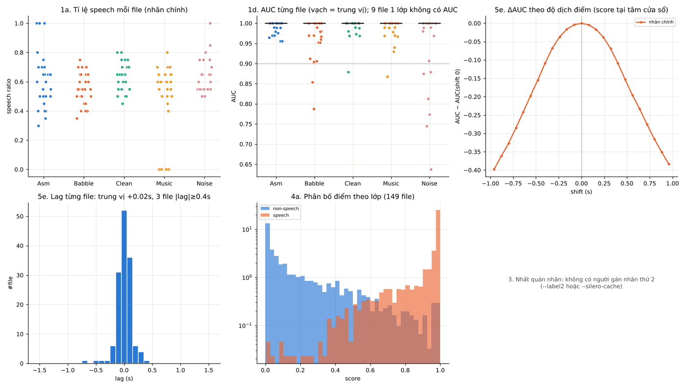

**Hình 2 – Tầng A.** ROC, PR, DET theo category trên điểm thô. Category có đường ROC nằm thấp là nơi model phân
biệt kém nhất, độc lập với ngưỡng.

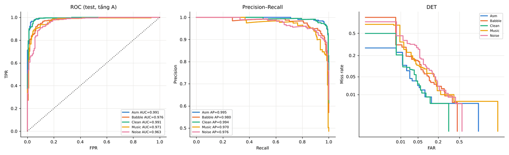

**Hình 3 – Ngưỡng và tầng B.** Trên trái: MR / FAR theo ngưỡng, vạch đen là ngưỡng đã chọn. Trên phải: lỗi biên
(xanh) so với lỗi thật (cam) theo category. Dưới trái: độ lệch biên đoạn (âm = bắt đầu sớm). Dưới phải: DCF trên dev
theo pad trước × merge gap; ô đậm nhất là cấu hình tốt nhất trong lưới.

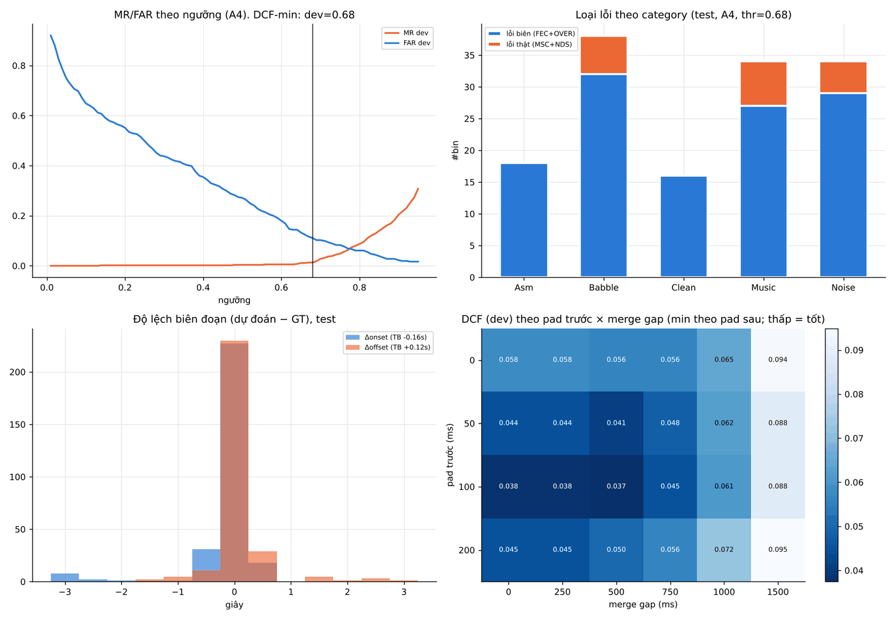

**Hình 4 – Timeline mẫu.** Nền xanh = nhãn speech, đường = điểm model, dải đen dưới = dự đoán A4. Dùng để xem
model sai ở đâu trong file.

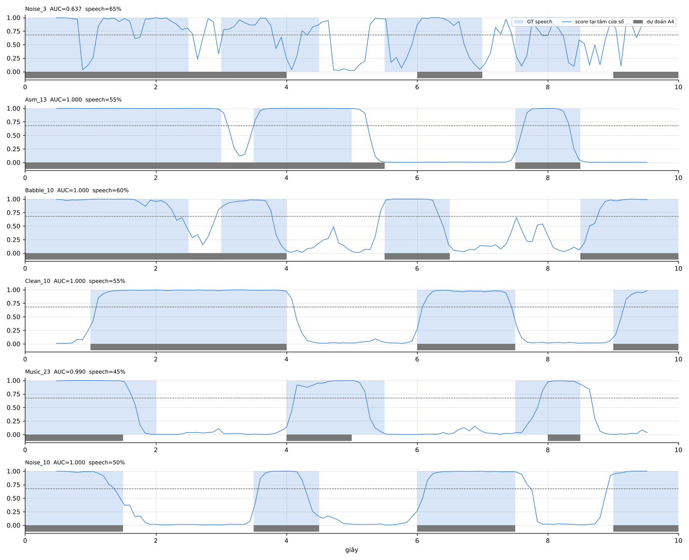

**Hình 5, 6 – Đặc trưng tập.** Đoạn / khoảng lặng ngắn hơn cửa sổ 0.96 s, cửa sổ lẫn, trần oracle (cách đọc chi
tiết ở README).

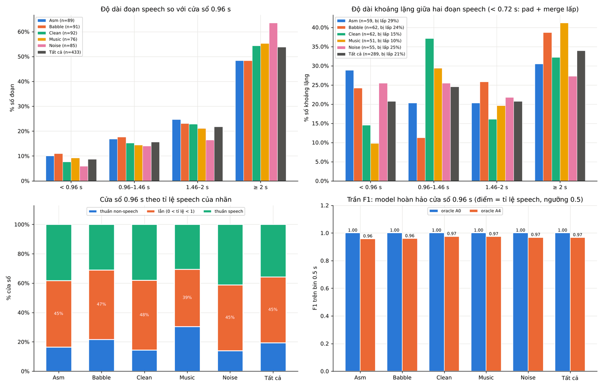

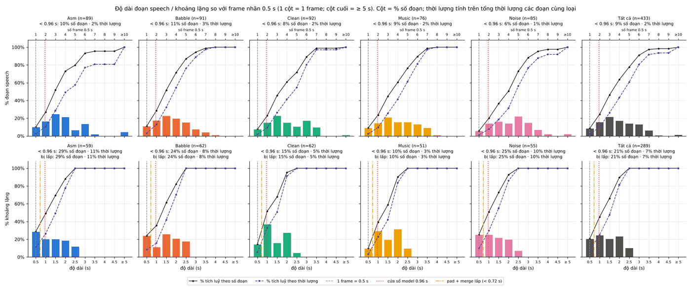

---

## 6. Phần 3 – Tinh chỉnh và so sánh hậu xử lý

Phần này nằm trong `evaluate_real.py` (mục 6), chạy mặc định. Nó trả lời câu hỏi: đổi bước hậu xử lý nào thì kết quả
tốt hơn cấu hình hiện tại, và tốt hơn có thật không.

### 6.1 Các cấu hình được so

| Mã | Cấu hình |
|---|---|
| B0 | Cấu hình hiện tại: tam giác + trung bình 5 hop, ngưỡng đơn, pad 100/120 ms → drop → merge < 500 ms. Luôn cố định để các lần chạy so được với nhau |
| CLI | Tham số dòng lệnh, chỉ hiện khi khác B0 và R |
| C1 | B0 + ngưỡng kép Δ 0.15 |
| C2 | B0 + thứ tự merge → drop 0.32 s → pad |
| C3 | B0 + pad 0 / 0 |
| C4 | B0 + làm mượt median 3 hop |
| C5 | B0 + không làm mượt |
| C6 | B0 + trọng số Hann |
| C7 | B0 + gộp miền logit |
| R | Đề xuất (`--preset de-xuat`): C1 + C2 + C3 + C4 |
| R-h16, R-h24 | Như R, chỉ giữ 1/2 hoặc 1/3 cửa sổ: mô phỏng hop 0.16 / 0.24 s, giảm 2–3× số lần chạy model |
| T | Chỉ có khi `--tune N`: cấu hình tốt nhất tìm được trên dev |

Hai thay đổi chính của cấu hình đề xuất, minh hoạ:

**C1 – ngưỡng kép (`--hyst`).** Điểm dao động quanh ngưỡng (hay gặp ở hát, đám đông) làm ngưỡng đơn tạo ra nhiều đoạn
vụn; ngưỡng kép chỉ tắt khi điểm xuống dưới ngưỡng − Δ.

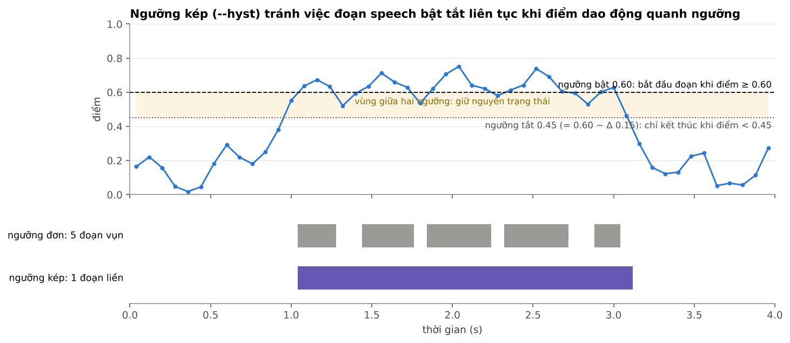

**C2 – thứ tự merge → drop → pad (`--order mdp`).** Speech bị vỡ thành nhiều mẩu ngắn sát nhau sẽ bị drop từng mẩu
nếu drop chạy trước merge; merge trước thì các mẩu được ghép lại, còn tiếng ho đứng riêng vẫn bị drop.

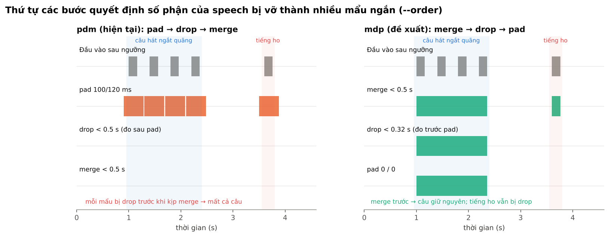

Với mỗi cấu hình: ngưỡng được chọn riêng trên dev theo `--criterion`, rồi đánh giá một lần trên test.
ΔF1 và ΔDCF so với B0 có CI 95% bootstrap ghép cặp theo file test.

### 6.2 Quy trình khuyến nghị

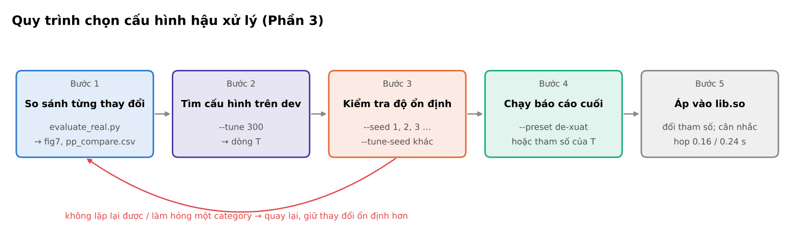

**Bước 1 — so sánh từng thay đổi** (lệnh mặc định đã có mục 6):

```bash
python evaluate_real.py --root <root> --out results_pp
```

Mở `results_pp/fig7_so_sanh_hau_xu_ly.png` hoặc `pp_compare.csv`:
- Dòng **xanh**: CI nằm hẳn bên phía tốt → tốt hơn B0 có ý nghĩa.
- Dòng **đỏ**: kém hơn B0 có ý nghĩa.
- Dòng **xám**: CI chứa 0 → chưa phân biệt được với số file test hiện có.

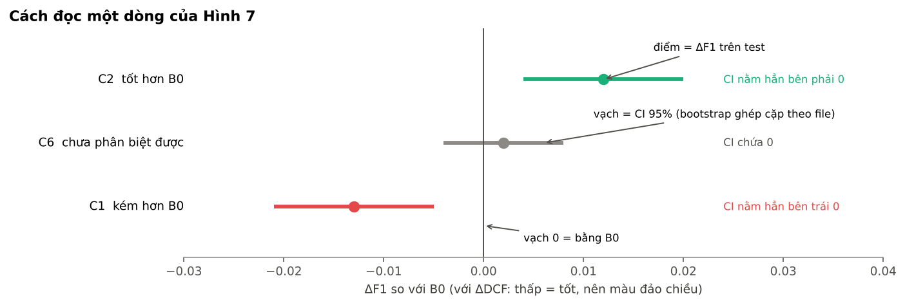

Ví dụ Hình 7 thật (dữ liệu giả định — trên dữ liệu này cấu hình đề xuất R kém B0, chỉ để minh hoạ cách đọc; kết luận
phải lấy từ dữ liệu thật của bạn):

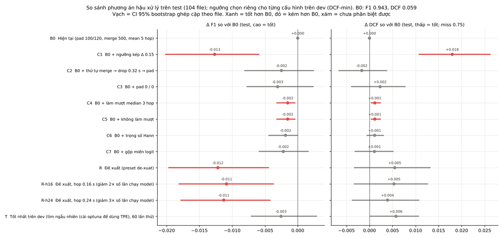

**Bước 2 — tìm cấu hình trên dev**:

```bash
python evaluate_real.py --root <root> --out results_tune --tune 300
```

- Có `optuna` thì dùng TPE (bắt đầu từ B0, R và cấu hình dòng lệnh); không có thì tìm ngẫu nhiên.
- Không gian tìm: overlap {tri, hann} × domain {prob, logit} × làm mượt {không, median 3, median 5, gauss 5, mean 5}
  × Δ ngưỡng kép 0–0.35 × thứ tự {pdm, mdp} × pad −0.16…+0.16 s × merge 0–1 s × drop 0–0.56 s.
- Mọi lần thử ở `pp_tune_trials.csv`; lần tốt nhất trên dev là dòng T.
- Tin T khi nó cũng tốt trên test (CI xanh) và không làm hỏng category nào (`pp_compare_category.csv`).
  Thử nhiều lần trên dev ít file dễ khớp riêng dev.
- Kiểm tra độ ổn định: chạy lại với `--seed` khác (chia dev/test khác) và `--tune-seed` khác; cấu hình tốt thật sẽ lặp lại.

**Bước 3 — chạy cả báo cáo với cấu hình đã chọn**:

```bash
# cấu hình đề xuất
python evaluate_real.py --root <root> --out results_dexuat --preset de-xuat
# hoặc cấu hình T (lấy giá trị từ dòng T trong pp_compare.csv)
python evaluate_real.py --root <root> --out results_T --overlap hann --smooth 5 --smooth-kind gauss --hyst 0.1 \
    --order pdm --pad-pre 0.12 --pad-post 0.12 --merge-gap 0 --drop 0
```

Khi đó A4, tầng B, category và Excel đều tính theo cấu hình mới; B0 trong mục 6 vẫn là cấu hình hiện tại để so.

**Bước 4 — cân nhắc hiệu năng**: nếu R-h16 / R-h24 không kém R có ý nghĩa, có thể tăng hop của lib.so lên 0.16 / 0.24 s
để giảm 2–3× lần chạy model (CPU, pin), rồi đo lại trên thiết bị.

### 6.3 Lưu ý khi đọc

- `AUC_hop_bin` chỉ đổi theo cách gộp cửa sổ, làm mượt và hop. Ngưỡng kép, pad, drop, merge không đổi AUC — so các
  bước này bằng F1, DCF, MR, FAR.
- Chọn cấu hình theo dev và theo nhiều category, không theo hàng tốt nhất trên test (`pp_best_on_test` chỉ để tham khảo).
- `F1_nb` (bỏ bin biên) cho biết thay đổi có cải thiện lỗi thật hay chỉ dịch biên.
- Pad lớn và merge lớn lấp các khoảng lặng ngắn của nhãn: xem `gap_filled_pp` trong `dataset_profile.csv` và fig6.

### 6.4 Output

| File | Nội dung |
|---|---|
| `pp_compare.csv` | Mỗi cấu hình một dòng: tham số, ngưỡng dev (và ngưỡng tắt nếu ngưỡng kép), MR, FAR, Precision, Recall, F1, F1_nb, DCF, AUC_hop_bin, event-F1, số đoạn, ΔF1 / ΔDCF + CI, P(ΔF1 > 0) |
| `pp_compare_category.csv` | Như trên theo category |
| `pp_tune_trials.csv` | Mọi lần thử của `--tune` (tham số, ngưỡng, F1 / DCF / MR / FAR trên dev) |
| `fig7_so_sanh_hau_xu_ly.png` | Hình Δ so với B0 |
| `summary.json` | Khoá `pp_compare`, `pp_best_on_test`, `pp_tuner`, `pp_tune_best` |

---

## 7. Phần 4 – Xuất Excel: `make_excel_real.py`

### 7.1 Chạy

```bash
python make_excel_real.py --res results_test --out results/Tong_hop_danh_gia_VAD_test.xlsx
python make_excel_real.py --res results_real --run C:/vad_work/run1     # ghi hash model vào sheet Snapshot
```

| Tham số | Mặc định | Ý nghĩa |
|---|---|---|
| `--res` | `results_real` | Thư mục kết quả của `evaluate_real.py` |
| `--out` | `results/Tong_hop_danh_gia_VAD_baseline_real.xlsx` | File Excel tạo ra (phải khác template) |
| `--template` | `results/Tong_hop_danh_gia_VAD_template.xlsx` | Template trống, không bị ghi |
| `--run` | | Thư mục run của model (`<run>/best/head_weights.npz`) để ghi hash |
| `--yamnet` | | File YAMNet tflite để ghi hash |

### 7.2 Quy ước màu

- **Nền vàng**: tham số bạn chỉnh được.
- **Chữ đen**: công thức Excel.
- **Chữ xanh**: số nhập từ Python (không sửa tay).

### 7.3 Các sheet

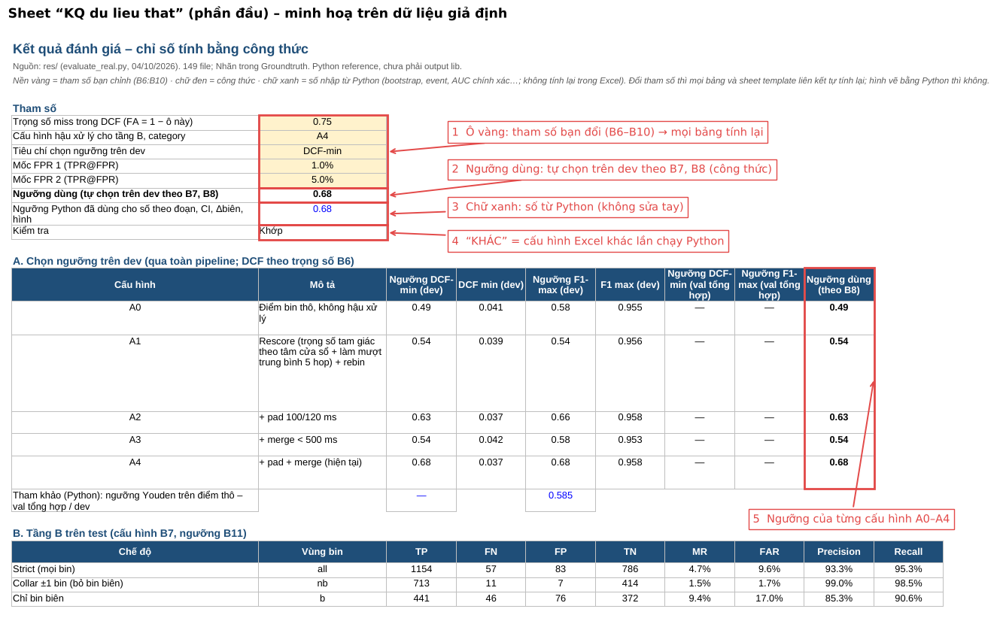

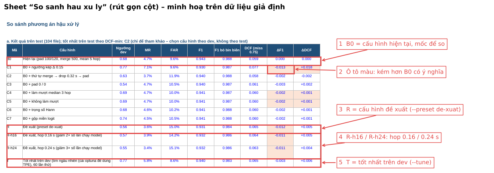

| Sheet | Nội dung |
|---|---|
| KQ du lieu that | Bảng chính. Ô vàng B6–B10: trọng số miss DCF, cấu hình (A0–A4), tiêu chí chọn ngưỡng, hai mốc FPR. Đổi là mọi bảng tính lại. Các mục: A chọn ngưỡng, B tầng B, C category, D ablation, E ngưỡng chọn ở đâu, F tầng A, G nhất quán nhãn, H kiểm tra theo file, I chỉ số theo đoạn, J đoạn nghi nhãn sai |
| So sanh hau xu ly | Bảng so sánh phương án hậu xử lý (mục 6), F1 / DCF / MR / FAR theo category, top lần thử của `--tune`, hình fig7. Ô ΔF1 / ΔDCF tô xanh khi tốt hơn B0, đỏ khi kém hơn |
| Dac trung tap danh gia | Đặc trưng tập theo độ phân giải model, dev vs test (chữ đỏ khi lệch > 10 điểm %) |
| Hinh du lieu that | Các hình fig1–fig7 |
| DL quet nguong, DL ROC, DL theo file, DL nhan va phan bo, DL do lech bien | Số đếm thô từ Python, nguồn cho công thức |
| Các sheet của template (Bao cao category, Ablation, KPI va Gate, Snapshot...) | Lấy số bằng công thức từ KQ du lieu that |

Ô B13 của "KQ du lieu that" báo "KHÁC" khi ngưỡng / cấu hình trong Excel khác ngưỡng Python: khi đó số theo đoạn, CI,
Δ biên và hình vẫn ở ngưỡng Python — chạy lại `evaluate_real.py` với tham số mới nếu cần các số này.

Kết quả cũ (chạy trước khi có mục 6) vẫn xuất được; sheet "So sanh hau xu ly" chỉ được tạo khi có `pp_compare.csv`.

---

## 8. Phần 5 – Demo dữ liệu giả định

Dùng để học quy trình hoặc thử code khi chưa có dữ liệu thật.

```bash
python gen_data.py      # sinh Model/, Groundtruth/, Annotator2/, meta.csv, train_sources.csv (150 clip 10 s, 5 category)
python evaluate.py      # quy trình đánh giá cho dữ liệu giả định -> results/
python make_excel.py    # Excel -> results/Ket_qua_danh_gia_VAD_gia_dinh.xlsx
```

- Dữ liệu có cài sẵn lỗi để các bước kiểm tra phát hiện: file thiếu cặp, 3 file lệch +0.5 s, file toàn speech / toàn
  non-speech, ~40–50% file dùng nguồn âm có trong train, nhạc có lời và babble gây false alarm.
- `evaluate.py` cần `meta.csv` và `Annotator2/`, chỉ dùng cho dữ liệu giả định. Dữ liệu khác dùng `evaluate_real.py`.
- Có thể chạy `evaluate_real.py --root .` trên chính dữ liệu giả định để thử phần 2 và phần 3.
- `gen_data.py` ghi vào thư mục repo và `evaluate.py` ghi đè `results/`; không commit các thư mục sinh ra
  (`Model/`, `Groundtruth/`, `Annotator2/`).

---

## 9. Phần 6 – Dùng `vadlib.py` trong code

Ví dụ hậu xử lý một file theo cấu hình đề xuất:

```python
from vadlib import (load_model, rescore_hop, hysteresis, frames_to_segs, postprocess_segs,
                    segs_to_bins_fast, frames_to_bin_scores, HOP, BIN)

m = load_model("Model/Asm_1.txt")                  # cột start, end, score, center
dur = 10.0                                         # thời lượng file (giây)

# 1. Rebin: điểm mỗi hop 0.08 s
fr = rescore_hop(m, dur=dur, weight="tri", smooth=3, smooth_kind="median", domain="prob")

# 2. Ngưỡng kép: bật khi >= 0.60, tắt khi < 0.45
mask = hysteresis(fr, on=0.60, off=0.45)

# 3. Đoạn speech + merge -> drop -> pad
segs = frames_to_segs(mask, HOP)                   # [[start, end], ...]
segs = postprocess_segs(segs, pre=0.0, post=0.0, gap=0.5, drop=0.32, dur=dur, order="mdp")

# 4. Đổi sang bin 0.5 s để so với nhãn
n_bins = int(dur / BIN)
pred_bins = segs_to_bins_fast(segs, n_bins)        # 0/1 mỗi bin
score_bins = frames_to_bin_scores(fr, n_bins)      # điểm liên tục mỗi bin (để tính AUC)
```

Các hàm chính:

| Hàm | Việc |
|---|---|
| `load_model(path)` | Đọc output model (`idx, start, end, score` hoặc `start end score`) |
| `load_gt(path)` | Đọc nhãn bin 0.5 s → mảng 0/1 |
| `bin_scores(m, n_bins)` | Điểm bin thô (A0) |
| `rescore_hop(m, dur, weight, smooth, smooth_kind, domain)` | Gộp cửa sổ chồng nhau thành điểm mỗi hop |
| `smooth_scores(x, n, kind)` | Làm mượt mean / median / gauss |
| `hysteresis(s, on, off)` | Ngưỡng đơn (`off=None`) hoặc ngưỡng kép |
| `frames_to_segs(mask, step)` | Mặt nạ 0/1 → danh sách đoạn |
| `postprocess_segs(segs, pre, post, gap, drop, dur, order)` | Pad / drop / merge theo thứ tự `pdm` hoặc `mdp` |
| `pad_merge(...)` | Hậu xử lý cũ (pad → drop → merge), giữ để tương thích |
| `segs_to_bins_fast(segs, n_bins)` | Đoạn → bin 0.5 s (bin speech khi đoạn phủ ≥ 50%) |
| `frames_to_bin_scores(fr, n_bins)` | Điểm hop → điểm bin theo phần thời gian chồng lấp |
| `rates(y, p, miss_w)` | TP / FN / FP / TN, MR, FAR, Precision, Recall, F1, DCF |
| `boundary_mask(y)`, `error_types(y, p)` | Bin biên; phân loại lỗi FEC / MSC / OVER / NDS |
| `event_f1`, `frag_merge`, `boundary_deltas` | Chỉ số theo đoạn |
| `window_frac`, `oracle_model`, `run_lengths`, `dist_to_transition` | Đặc trưng tập theo độ phân giải model |

---

## 10. Quy trình gợi ý từ đầu đến cuối

1. **Chuẩn bị**: đặt output model, nhãn, audio theo mục 3. Chưa có nhãn → `auto_label.py`, nghe lại `review.csv`.
2. **Chạy đánh giá lần đầu** với cấu hình hiện tại:
   `python evaluate_real.py --root <root> --out results_v1`
3. **Kiểm tra dữ liệu** (mục 5.5 bước 1). Sửa nhãn sai, file lệch, file thiếu; chạy lại nếu có sửa.
4. **Đọc kết quả** tầng A, tầng B, category, ablation.
5. **So sánh hậu xử lý**: xem fig7 / `pp_compare.csv`; chạy `--tune 300` để tìm cấu hình trên dev.
6. **Kiểm tra độ ổn định**: lặp lại với `--seed` khác; giữ thay đổi nào tốt ổn định qua các lần và các category.
7. **Chạy báo cáo cuối** với cấu hình đã chọn (`--preset de-xuat` hoặc tham số của T) vào thư mục mới.
8. **Xuất Excel**: `python make_excel_real.py --res results_final --out results/Tong_hop_danh_gia_VAD_final.xlsx`.
9. **Áp vào lib.so**: cập nhật tham số hậu xử lý; nếu R-h16 / R-h24 đạt yêu cầu, cân nhắc tăng hop; đo lại runtime, CPU,
   pin trên thiết bị và chạy lại đánh giá với output mới của lib.

---

## 11. Lỗi thường gặp

| Thông báo | Nguyên nhân | Cách xử lý |
|---|---|---|
| `Không tìm thấy thư mục --raw` / `--gt` | Tên thư mục không khớp danh sách tự tìm | Chỉ rõ bằng `--raw <thư mục>` / `--gt <thư mục>` |
| `Không ghép được file nào giữa output model, nhãn và audio` | Tên file không ghép được (thông báo in ví dụ tên của từng nguồn) | Đổi tên cho khớp mục 3.2; nếu thiếu audio, bỏ `--audio` hoặc để audio ngoài `--root` |
| `nhãn không đọc được` | Dòng nhãn có chữ lạ | Sửa dòng đó về `speech` / `non-speech` |
| `Chia dev/test ra 0 / N file` | Quá ít file hoặc `--dev-frac` quá nhỏ / lớn | Thêm file hoặc đổi `--dev-frac` |
| `pad âm quá lớn` | `--pad-pre` / `--pad-post` ≤ −0.48 | Dùng giá trị âm nhỏ hơn |
| `merge / drop / hyst phải >= 0` | Giá trị âm cho các tham số này | Dùng giá trị ≥ 0 |
| `thr_at_grid_edge` trong summary.json khác rỗng | Ngưỡng tốt nhất nằm ở mép dải quét | Mở rộng `--thr-min` / `--thr-max` |
| Dòng T ghi "tìm ngẫu nhiên (cài optuna để dùng TPE)" | Chưa cài optuna | `pip install optuna` (không bắt buộc) |
| Excel ô B13 báo "KHÁC" | Đổi cấu hình / ngưỡng trong Excel | Bình thường; chạy lại Python nếu cần số theo đoạn ở cấu hình mới |
| Chạy chậm | Bộ dữ liệu lớn, `--n-boot` cao, `--tune` nhiều | Thử với `--n-boot 200`, `--no-compare`, bớt `--tune` |
