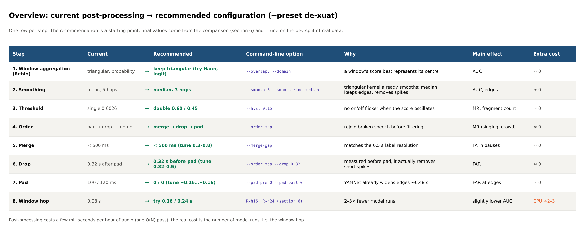
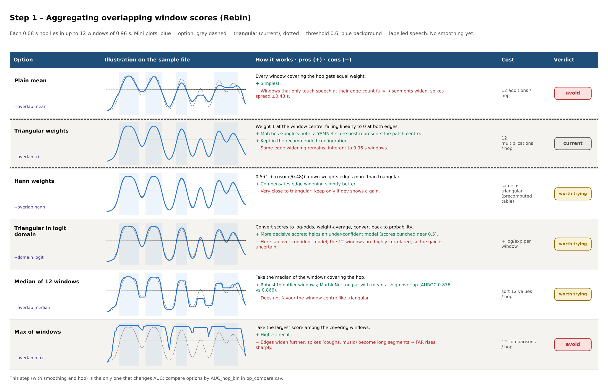
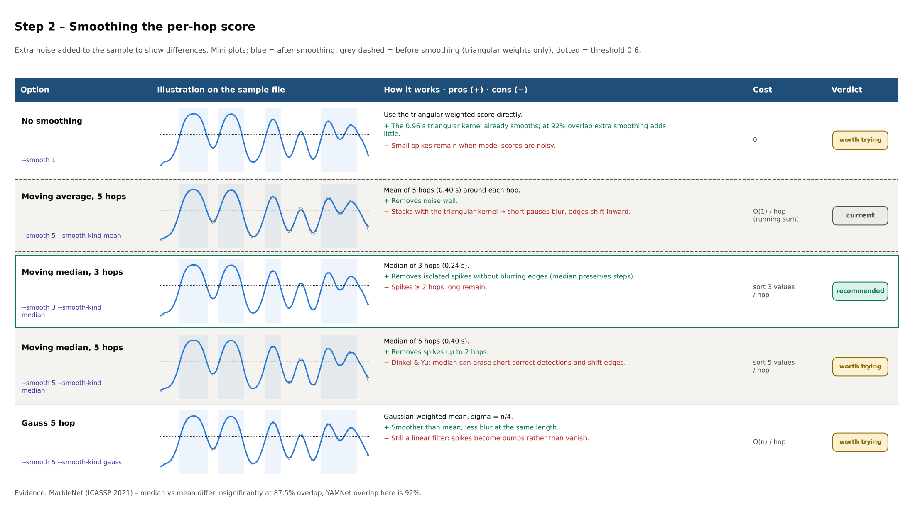
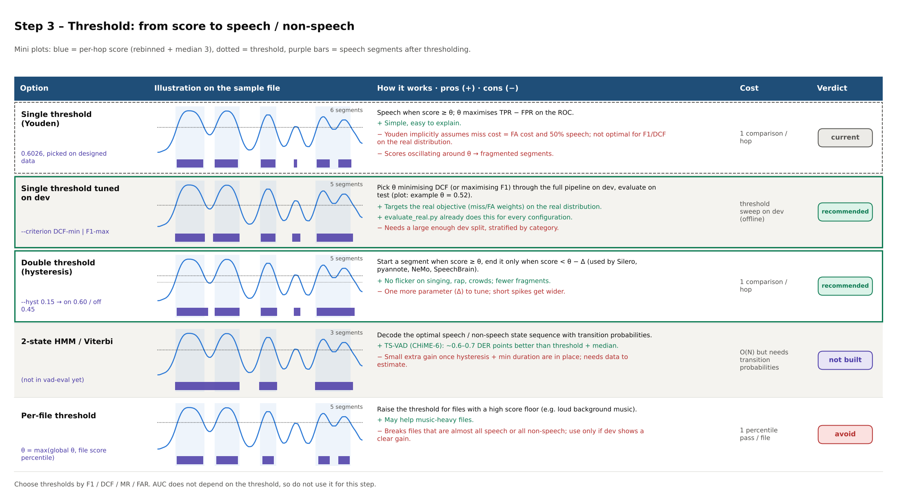
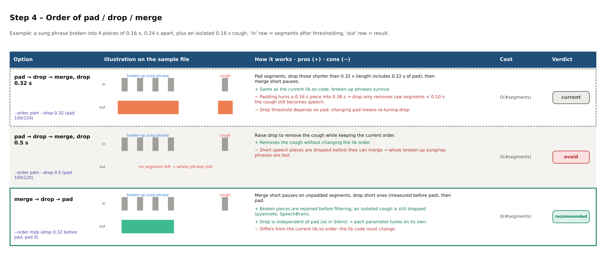
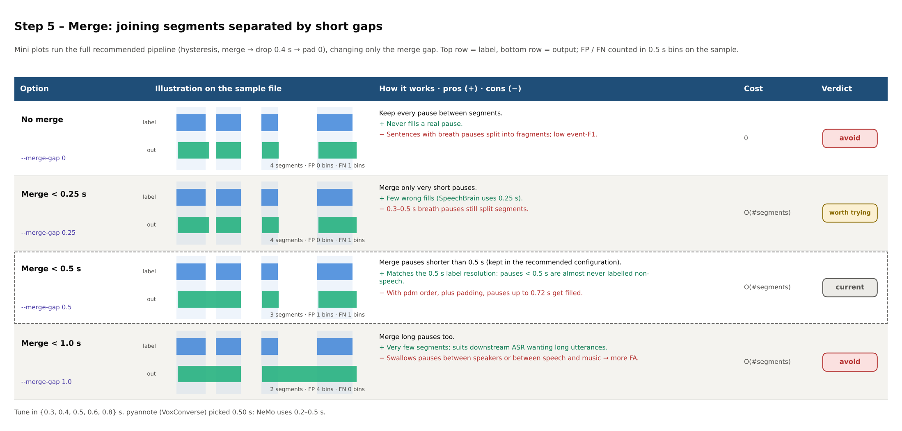
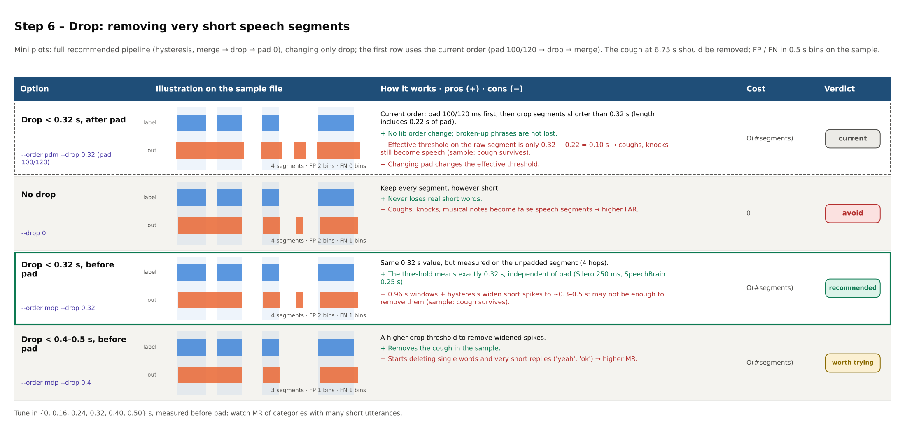
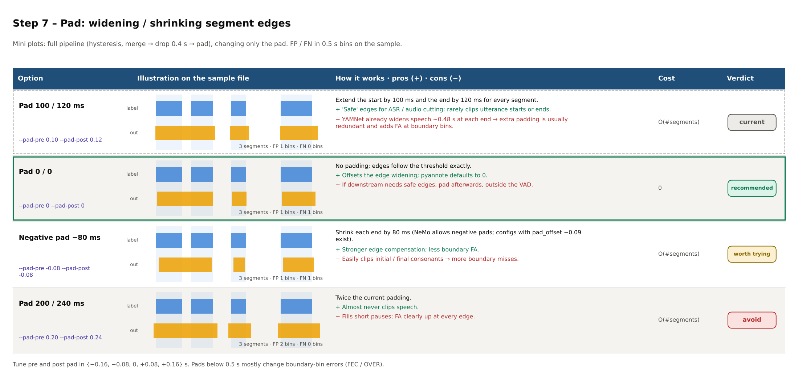
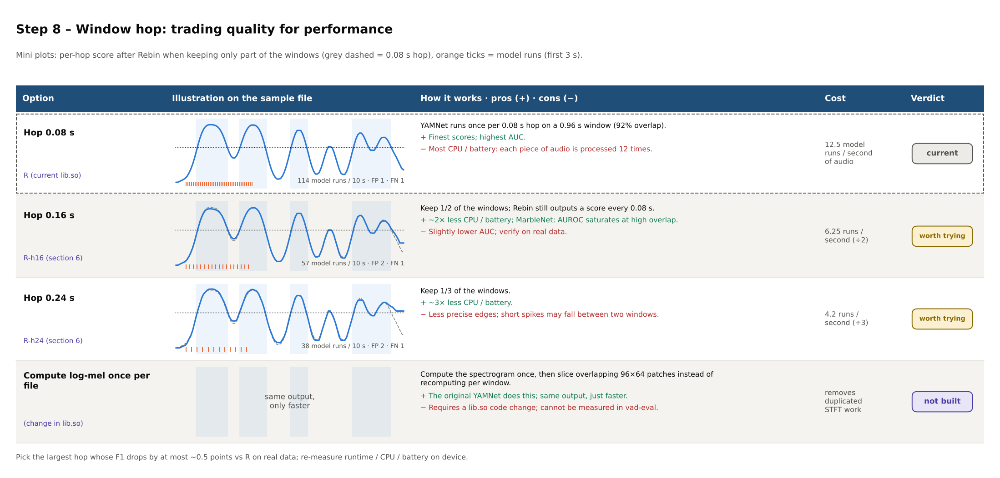

# Post-processing optimisation options – step-by-step comparison

*Tiếng Việt: [SO_SANH_TOI_UU.md](SO_SANH_TOI_UU.md)*

This document compares each post-processing step in table form. Every step has:

- a visual table: one row per option, with an illustration on **the same 10 s sample file**;
- a short text table for quick lookup.

Read it together with [HUONG_DAN_SU_DUNG.md](HUONG_DAN_SU_DUNG.md) (how to run, Vietnamese) and
[vad_post_processing.md](vad_post_processing.md) (what each step does).

**About the sample file:** a synthetic signal with a short breath pause (2.55 s), a cough (6.75 s) and a quiet passage
that makes the score dip (8.6 s). The plots run the actual `vadlib.py` functions. FP / FN counts on the plots are
counted on this sample only, to show the trend; **choose the configuration from the comparison on real data**
(section 6 of `evaluate_real.py`, `--tune`).

**Verdict labels used in the tables:**

| Label | Meaning |
|---|---|
| current | Configuration currently in lib.so (B0) |
| recommended | Part of `--preset de-xuat` (R) |
| worth trying | Worth including when tuning; keep it only if both dev and test show a gain |
| avoid | Usually makes results worse on the current data |
| not built | Not implemented in vad-eval / lib.so yet; listed for reference |

Regenerate all images: `python docs/make_compare_tables.py --lang en` (Vietnamese: without `--lang`).

---

## Overview

| Step | Current | Recommended | Option | Main effect |
|---|---|---|---|---|
| 1. Window aggregation | triangular | keep triangular (try Hann, logit) | `--overlap`, `--domain` | AUC |
| 2. Smoothing | mean, 5 hops | median, 3 hops | `--smooth 3 --smooth-kind median` | AUC, edges |
| 3. Threshold | single 0.6026 | double 0.60 / 0.45, tuned on dev | `--hyst 0.15`, `--criterion` | MR, fragment count |
| 4. Order | pad → drop → merge | merge → drop → pad | `--order mdp` | MR (singing, crowd) |
| 5. Merge | < 0.5 s | < 0.5 s (tune 0.3–0.8) | `--merge-gap` | FA in pauses |
| 6. Drop | 0.32 s after pad | 0.32 s before pad (tune 0.32–0.5) | `--order mdp --drop` | FAR |
| 7. Pad | 100 / 120 ms | 0 / 0 (tune −0.16…+0.16) | `--pad-pre`, `--pad-post` | FA at edges |
| 8. Hop | 0.08 s | try 0.16 / 0.24 s | R-h16, R-h24 | CPU ÷2–3, slightly lower AUC |

Run the full report with the recommended configuration:
`python evaluate_real.py --root <root> --out results_dexuat --preset de-xuat`.

---

## Step 1 – Aggregating overlapping window scores (Rebin)

| Option | Flag | Pros | Cons | Verdict |
|---|---|---|---|---|
| Plain mean | `--overlap mean` | simple | edges widen, spikes spread ±0.48 s | avoid |
| Triangular weights | `--overlap tri` | favours the window centre, where a YAMNet score is most accurate | some edge widening remains | current, kept in recommended |
| Hann weights | `--overlap hann` | down-weights edges more | very close to triangular | worth trying |
| Triangular, logit domain | `--domain logit` | more decisive scores | hurts an over-confident model | worth trying |
| Median of 12 windows | `--overlap median` | robust to outliers | does not favour the centre | worth trying |
| Max | `--overlap max` | high recall | FA rises sharply | avoid |

Compare this step by **AUC** (`AUC_hop_bin` in `pp_compare.csv`), because this is the step that changes the scores.

## Step 2 – Smoothing the per-hop score

| Option | Flag | Pros | Cons | Verdict |
|---|---|---|---|---|
| No smoothing | `--smooth 1` | the triangular kernel already smooths | small spikes remain | worth trying |
| Moving average, 5 hops | `--smooth 5 --smooth-kind mean` | removes noise well | blurs short pauses, edges shift inward | current |
| Moving median, 3 hops | `--smooth 3 --smooth-kind median` | removes isolated spikes, keeps edges | spikes ≥ 2 hops remain | recommended |
| Moving median, 5 hops | `--smooth 5 --smooth-kind median` | removes spikes up to 2 hops | can erase short correct detections | worth trying |
| Gaussian, 5 hops | `--smooth 5 --smooth-kind gauss` | smooth, less blur than mean | spikes become bumps, do not vanish | worth trying |

## Step 3 – Threshold

| Option | Flag | Pros | Cons | Verdict |
|---|---|---|---|---|
| Single threshold (Youden) | 0.6026 | simple | not optimal for F1 / DCF; fragments when the score oscillates | current |
| Single threshold tuned on dev | `--criterion DCF-min \| F1-max` | matches the real objective and distribution | needs a large enough dev split | recommended |
| Double threshold (hysteresis) | `--hyst 0.15` | no on/off flicker | extra parameter Δ; spikes get wider | recommended |
| 2-state HMM / Viterbi | (not built) | ~0.6 DER points better than threshold + median (TS-VAD) | small extra gain, needs estimation | not built |
| Per-file threshold | (no flag) | helps files with loud background music | breaks near single-class files | avoid |

Compare this step by **F1 / DCF / MR / FAR**; AUC does not depend on the threshold.

## Step 4 – Order of pad / drop / merge

| Option | Flag | Pros | Cons | Verdict |
|---|---|---|---|---|
| pad → drop → merge, drop 0.32 s | `--order pdm --drop 0.32` | same as current lib.so; broken-up phrases survive | padding turns a 0.16 s spike into 0.38 s → the cough is not dropped; drop depends on pad | current |
| pad → drop → merge, drop 0.5 s | `--order pdm --drop 0.5` | removes the cough, no lib change | broken speech dropped before merging → whole phrase lost | avoid |
| merge → drop → pad | `--order mdp` | rejoins broken speech first; drop independent of pad | lib.so order must change | recommended |

## Step 5 – Merge

| Option | Flag | Pros | Cons | Verdict |
|---|---|---|---|---|
| No merge | `--merge-gap 0` | never fills a real pause | fragments, low event-F1 | avoid |
| < 0.25 s | `--merge-gap 0.25` | few wrong fills | 0.3–0.5 s breath pauses still split | worth trying |
| < 0.5 s | `--merge-gap 0.5` | matches the 0.5 s label resolution | with pdm + pad, fills up to 0.72 s | current, kept in recommended |
| < 1.0 s | `--merge-gap 1.0` | few segments, suits ASR | swallows real pauses, more FA | avoid |

## Step 6 – Drop

| Option | Flag | Pros | Cons | Verdict |
|---|---|---|---|---|
| < 0.32 s, after pad | `--order pdm --drop 0.32` | no order change; broken-up phrases survive | effective threshold on the raw segment is only 0.10 s → coughs, knocks still become speech | current |
| No drop | `--drop 0` | never loses short words | coughs, knocks, notes become false speech | avoid |
| < 0.32 s, before pad | `--order mdp --drop 0.32` | same value but truly 0.32 s; as in Silero / SpeechBrain; independent of pad | widened spikes may survive | recommended |
| < 0.4–0.5 s, before pad | `--order mdp --drop 0.4` | removes widened spikes | deletes very short replies ("yeah", "ok") | worth trying |

## Step 7 – Pad

| Option | Flag | Pros | Cons | Verdict |
|---|---|---|---|---|
| 100 / 120 ms | `--pad-pre 0.10 --pad-post 0.12` | safe edges for ASR | YAMNet already widens edges ~0.48 s → boundary FA | current |
| 0 / 0 | `--pad-pre 0 --pad-post 0` | offsets edge widening; pyannote default | pad later if downstream needs it | recommended |
| −80 ms | `--pad-pre -0.08 --pad-post -0.08` | even less boundary FA | may clip initial / final consonants | worth trying |
| 200 / 240 ms | `--pad-pre 0.20 --pad-post 0.24` | almost never clips speech | fills pauses, more FA | avoid |

On the sample file, pad 100/120 ms gives fewer FN than pad 0 — exactly the "pros" column. On real data, decide by
DCF / F1 and by the edge requirements of the downstream use.

## Step 8 – Window hop (performance)

| Option | Model runs / second of audio | Pros | Cons | Verdict |
|---|---|---|---|---|
| Hop 0.08 s | 12.5 | finest scores | most CPU / battery | current |
| Hop 0.16 s (R-h16) | 6.25 | CPU ÷2 | slightly lower AUC | worth trying |
| Hop 0.24 s (R-h24) | 4.2 | CPU ÷3 | less precise edges | worth trying |
| Log-mel once per file | unchanged | faster, identical output | requires a lib.so change | not built |

Pick the largest hop whose F1 drops by at most ~0.5 points vs R on real data, then re-measure runtime / CPU / battery
on the device.

---

## How to use these tables

1. Run the comparison on real data: `python evaluate_real.py --root <root> --out results_pp --tune 300`.
2. For each step, find the matching row (C1–C7, R, R-h16, R-h24, T) in `pp_compare.csv` or Figure 7.
3. Keep changes that are **significantly better than B0** (green CI) and do not hurt any category; drop red-CI changes.
4. Re-run with a different `--seed` to confirm stability, then run the final report with the chosen configuration.

Main references (details in the post-processing optimisation report): source code / docs of Silero VAD,
pyannote.audio, NVIDIA NeMo, SpeechBrain, WebRTC VAD; MarbleNet (arXiv:2010.13886); Dinkel & Yu (arXiv:1904.03841);
TS-VAD (CHiME-6); Smits, BMC Med Res Methodol 2010;10:89 (Youden index); audioset-users group discussion on YAMNet hop
and scores.
