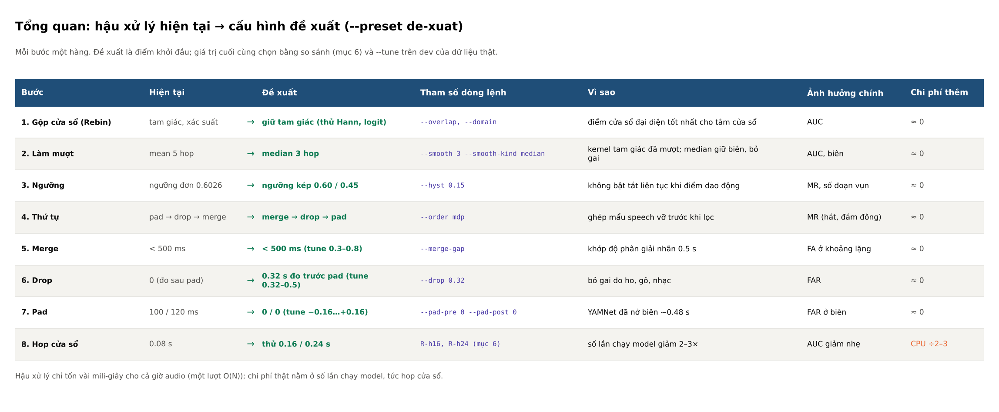
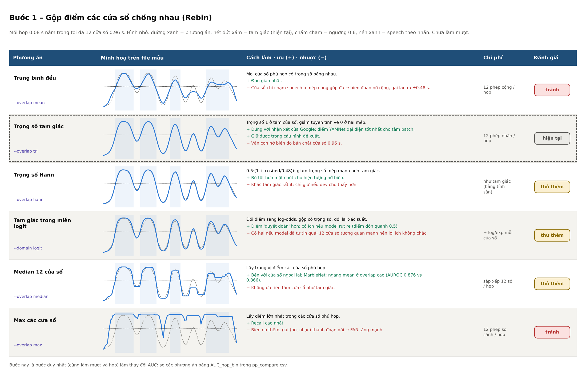
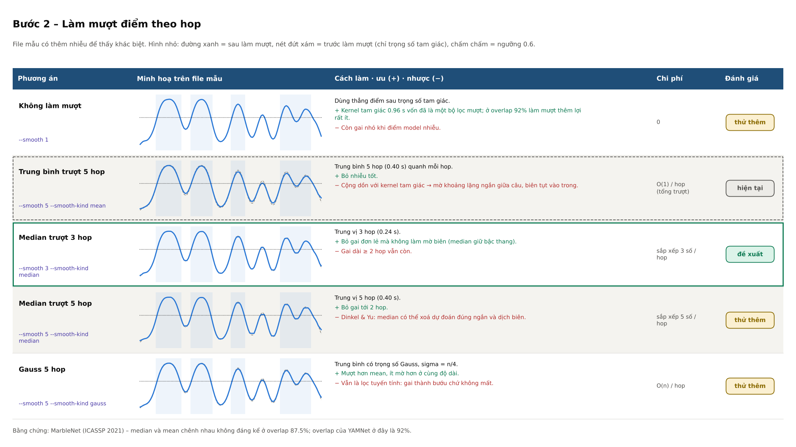
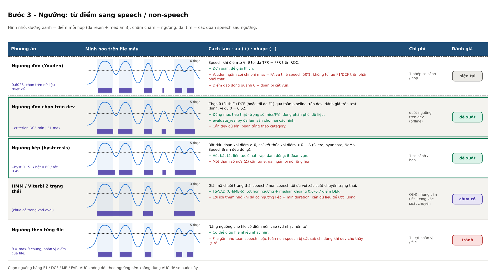
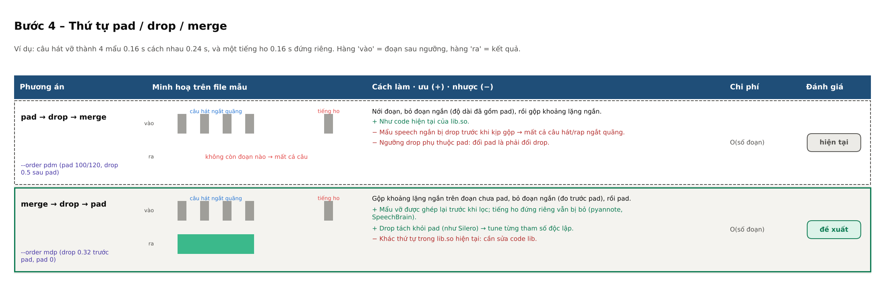
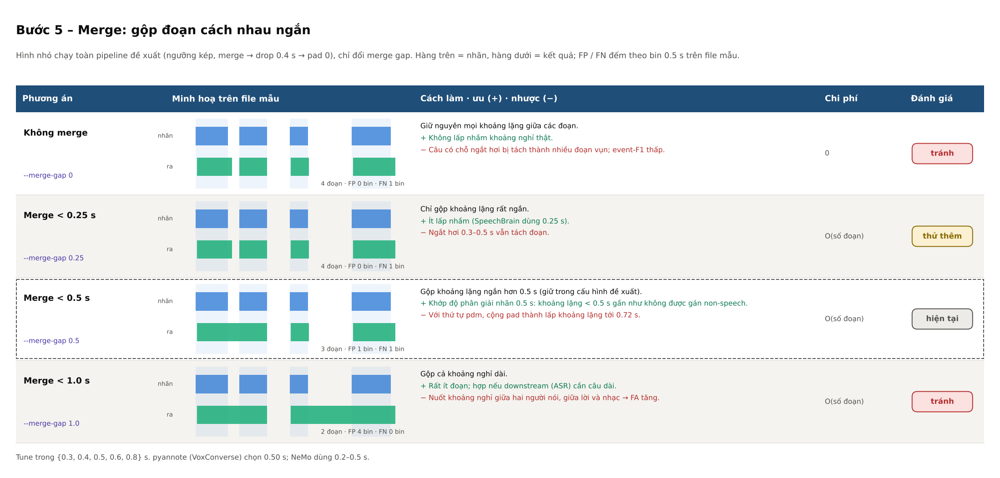
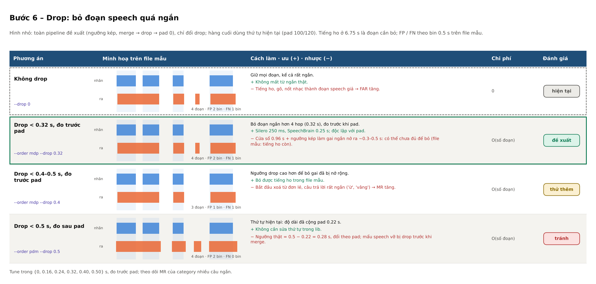
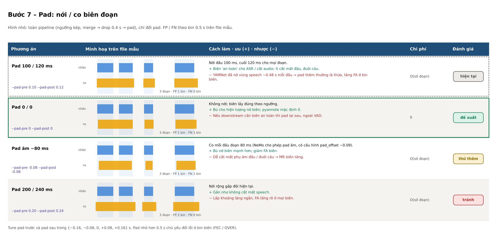
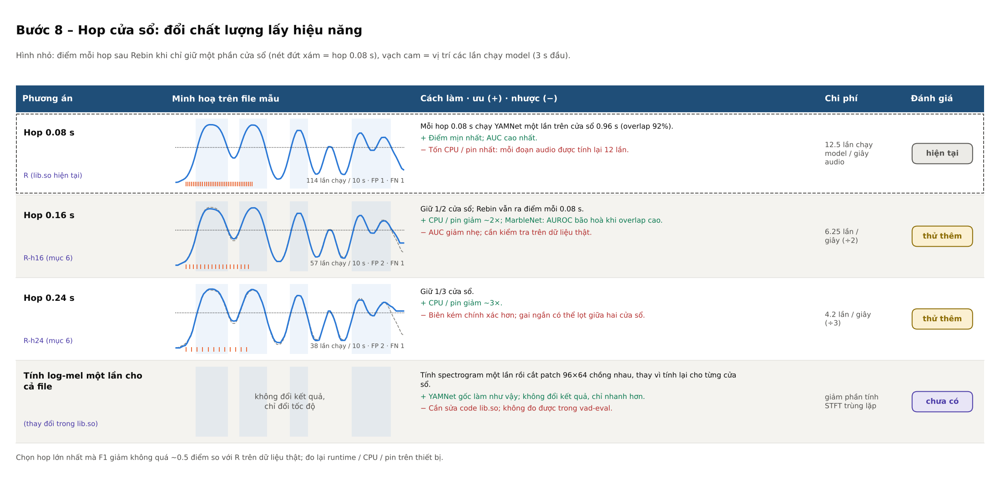

# So sánh các phương án tối ưu hậu xử lý – từng bước

Tài liệu này so sánh từng bước hậu xử lý theo dạng bảng. Mỗi bước có hai phần:

- một bảng hình: mỗi phương án một hàng, kèm hình minh hoạ trên **cùng một file mẫu 10 s**;
- một bảng chữ ngắn để tra nhanh.

Đọc cùng [HUONG_DAN_SU_DUNG.md](HUONG_DAN_SU_DUNG.md) (cách chạy) và [vad_post_processing.md](vad_post_processing.md)
(mô tả các bước).

**Về file mẫu:** tín hiệu tự tạo, có một chỗ ngắt hơi ngắn (2.55 s), một tiếng ho (6.75 s) và một đoạn nói nhỏ làm điểm
tụt (8.6 s). Hình chạy đúng các hàm của `vadlib.py`. Số FP / FN trên hình chỉ đếm trên file mẫu này để thấy xu hướng;
**chọn cấu hình phải dựa vào kết quả so sánh trên dữ liệu thật** (mục 6 của `evaluate_real.py`, `--tune`).

**Nhãn đánh giá trong các bảng:**

| Nhãn | Nghĩa |
|---|---|
| hiện tại | Cấu hình đang dùng trong lib.so (B0) |
| đề xuất | Có trong `--preset de-xuat` (R) |
| thử thêm | Đáng thử khi tune; giữ lại nếu dev và test cùng cho thấy tốt hơn |
| tránh | Thường làm kết quả xấu đi với dữ liệu hiện tại |
| chưa có | Chưa cài trong vad-eval / lib.so; ghi lại để tham khảo |

Vẽ lại tất cả hình: `python docs/make_compare_tables.py`.

---

## Tổng quan

| Bước | Hiện tại | Đề xuất | Tham số | Ảnh hưởng chính |
|---|---|---|---|---|
| 1. Gộp cửa sổ | tam giác | giữ tam giác (thử Hann, logit) | `--overlap`, `--domain` | AUC |
| 2. Làm mượt | mean 5 hop | median 3 hop | `--smooth 3 --smooth-kind median` | AUC, biên |
| 3. Ngưỡng | đơn 0.6026 | kép 0.60 / 0.45, chọn trên dev | `--hyst 0.15`, `--criterion` | MR, số đoạn vụn |
| 4. Thứ tự | pad → drop → merge | merge → drop → pad | `--order mdp` | MR (hát, đám đông) |
| 5. Merge | < 0.5 s | < 0.5 s (tune 0.3–0.8) | `--merge-gap` | FA ở khoảng lặng |
| 6. Drop | 0 | 0.32 s đo trước pad (tune 0.32–0.5) | `--drop` | FAR |
| 7. Pad | 100 / 120 ms | 0 / 0 (tune −0.16…+0.16) | `--pad-pre`, `--pad-post` | FA ở biên |
| 8. Hop | 0.08 s | thử 0.16 / 0.24 s | R-h16, R-h24 | CPU ÷2–3, AUC giảm nhẹ |

Chạy cả báo cáo với cấu hình đề xuất: `python evaluate_real.py --root <root> --out results_dexuat --preset de-xuat`.

---

## Bước 1 – Gộp điểm các cửa sổ chồng nhau (Rebin)

| Phương án | Tham số | Ưu | Nhược | Đánh giá |
|---|---|---|---|---|
| Trung bình đều | `--overlap mean` | đơn giản | biên nở rộng, gai lan ±0.48 s | tránh |
| Trọng số tam giác | `--overlap tri` | ưu tiên tâm cửa sổ, nơi điểm YAMNet đúng nhất | vẫn còn nở biên | hiện tại, giữ trong đề xuất |
| Trọng số Hann | `--overlap hann` | giảm mép mạnh hơn | khác tam giác rất ít | thử thêm |
| Tam giác miền logit | `--domain logit` | điểm quyết đoán hơn | hại nếu model đã tự tin quá | thử thêm |
| Median 12 cửa sổ | `--overlap median` | bền với ngoại lai | không ưu tiên tâm | thử thêm |
| Max | `--overlap max` | recall cao | FA tăng mạnh | tránh |

So bước này bằng **AUC** (`AUC_hop_bin` trong `pp_compare.csv`), vì đây là bước làm thay đổi điểm.

## Bước 2 – Làm mượt điểm theo hop

| Phương án | Tham số | Ưu | Nhược | Đánh giá |
|---|---|---|---|---|
| Không làm mượt | `--smooth 1` | kernel tam giác đã mượt sẵn | còn gai nhỏ | thử thêm |
| Trung bình 5 hop | `--smooth 5 --smooth-kind mean` | bỏ nhiễu tốt | mờ khoảng lặng ngắn, biên tụt | hiện tại |
| Median 3 hop | `--smooth 3 --smooth-kind median` | bỏ gai đơn lẻ, giữ biên | gai ≥ 2 hop còn | đề xuất |
| Median 5 hop | `--smooth 5 --smooth-kind median` | bỏ gai tới 2 hop | có thể xoá dự đoán đúng ngắn | thử thêm |
| Gauss 5 hop | `--smooth 5 --smooth-kind gauss` | mượt, ít mờ hơn mean | gai thành bướu, không mất | thử thêm |

## Bước 3 – Ngưỡng

| Phương án | Tham số | Ưu | Nhược | Đánh giá |
|---|---|---|---|---|
| Ngưỡng đơn Youden | 0.6026 | đơn giản | không tối ưu F1/DCF; đoạn vụn khi điểm dao động | hiện tại |
| Ngưỡng đơn chọn trên dev | `--criterion DCF-min \| F1-max` | đúng mục tiêu và phân phối thật | cần dev đủ lớn | đề xuất |
| Ngưỡng kép | `--hyst 0.15` | hết bật tắt liên tục | thêm tham số Δ; gai nở rộng hơn | đề xuất |
| HMM / Viterbi | (chưa có) | tốt hơn ngưỡng + median ~0.6 điểm DER (TS-VAD) | lợi thêm nhỏ, cần ước lượng | chưa có |
| Ngưỡng theo file | (không có tham số) | giúp file nhạc nền to | sai với file gần như một lớp | tránh |

So bước này bằng **F1 / DCF / MR / FAR**; AUC không đổi theo ngưỡng.

## Bước 4 – Thứ tự pad / drop / merge

| Phương án | Tham số | Ưu | Nhược | Đánh giá |
|---|---|---|---|---|
| pad → drop → merge | `--order pdm` | như lib.so hiện tại | mẩu speech vỡ bị drop trước khi gộp; drop phụ thuộc pad | hiện tại |
| merge → drop → pad | `--order mdp` | ghép mẩu vỡ trước; drop độc lập với pad | phải sửa thứ tự trong lib.so | đề xuất |

## Bước 5 – Merge

| Phương án | Tham số | Ưu | Nhược | Đánh giá |
|---|---|---|---|---|
| Không merge | `--merge-gap 0` | không lấp nhầm | đoạn vụn, event-F1 thấp | tránh |
| < 0.25 s | `--merge-gap 0.25` | ít lấp nhầm | ngắt hơi 0.3–0.5 s vẫn tách | thử thêm |
| < 0.5 s | `--merge-gap 0.5` | khớp độ phân giải nhãn 0.5 s | với pdm + pad lấp tới 0.72 s | hiện tại, giữ trong đề xuất |
| < 1.0 s | `--merge-gap 1.0` | ít đoạn, hợp ASR | nuốt khoảng nghỉ thật, FA tăng | tránh |

## Bước 6 – Drop

| Phương án | Tham số | Ưu | Nhược | Đánh giá |
|---|---|---|---|---|
| Không drop | `--drop 0` | không mất từ ngắn | ho, gõ, nốt nhạc thành speech giả | hiện tại |
| < 0.32 s, trước pad | `--order mdp --drop 0.32` | như Silero / SpeechBrain; độc lập với pad | gai đã nở rộng có thể còn | đề xuất |
| < 0.4–0.5 s, trước pad | `--order mdp --drop 0.4` | bỏ được gai nở rộng | xoá câu rất ngắn ("ừ", "vâng") | thử thêm |
| < 0.5 s, sau pad | `--order pdm --drop 0.5` | không cần sửa thứ tự | ngưỡng thật đổi theo pad; drop trước merge | tránh |

## Bước 7 – Pad

| Phương án | Tham số | Ưu | Nhược | Đánh giá |
|---|---|---|---|---|
| 100 / 120 ms | `--pad-pre 0.10 --pad-post 0.12` | biên an toàn cho ASR | YAMNet đã nở biên ~0.48 s → FA biên | hiện tại |
| 0 / 0 | `--pad-pre 0 --pad-post 0` | bù nở biên; mặc định của pyannote | pad lại sau nếu downstream cần | đề xuất |
| −80 ms | `--pad-pre -0.08 --pad-post -0.08` | giảm FA biên hơn nữa | dễ cắt phụ âm đầu / cuối | thử thêm |
| 200 / 240 ms | `--pad-pre 0.20 --pad-post 0.24` | gần như không cắt speech | lấp khoảng lặng, FA tăng | tránh |

Trên file mẫu, pad 100/120 ms cho ít FN hơn pad 0 — đúng như cột "ưu". Trên dữ liệu thật, chọn theo DCF / F1 và
theo nhu cầu biên của downstream.

## Bước 8 – Hop cửa sổ (hiệu năng)

| Phương án | Số lần chạy model / giây audio | Ưu | Nhược | Đánh giá |
|---|---|---|---|---|
| Hop 0.08 s | 12.5 | điểm mịn nhất | tốn CPU / pin nhất | hiện tại |
| Hop 0.16 s (R-h16) | 6.25 | CPU ÷2 | AUC giảm nhẹ | thử thêm |
| Hop 0.24 s (R-h24) | 4.2 | CPU ÷3 | biên kém chính xác hơn | thử thêm |
| Log-mel một lần cho cả file | không đổi | nhanh hơn, kết quả y hệt | phải sửa lib.so | chưa có |

Chọn hop lớn nhất mà F1 giảm không quá ~0.5 điểm so với R trên dữ liệu thật, rồi đo lại runtime / CPU / pin trên thiết bị.

---

## Cách dùng các bảng này

1. Chạy so sánh trên dữ liệu thật: `python evaluate_real.py --root <root> --out results_pp --tune 300`.
2. Với mỗi bước, tìm dòng tương ứng (C1–C7, R, R-h16, R-h24, T) trong `pp_compare.csv` hoặc Hình 7.
3. Giữ thay đổi nào **tốt hơn B0 có ý nghĩa** (CI xanh) và không làm hỏng category nào; bỏ thay đổi CI đỏ.
4. Chạy lại với `--seed` khác để chắc kết quả ổn định, rồi chạy báo cáo cuối với cấu hình đã chọn.

Nguồn tham khảo chính (chi tiết trong báo cáo tối ưu hậu xử lý): mã nguồn / tài liệu của Silero VAD, pyannote.audio,
NVIDIA NeMo, SpeechBrain, WebRTC VAD; MarbleNet (arXiv:2010.13886); Dinkel & Yu (arXiv:1904.03841); TS-VAD (CHiME-6);
Smits, BMC Med Res Methodol 2010;10:89 (Youden index); thảo luận nhóm audioset-users về hop và điểm YAMNet.
