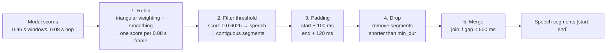

# VAD – Model Output Post-Processing

_As of 2026-10-02_

## Overview

Post-processing turns YAMNet's raw scores (one per 0.96 s window, 0.08 s hop) into a list of speech segments `[start, end]` through five fixed steps: **Rebin → Filter threshold → Padding → Drop → Merge**. It runs inside `lib.so`, on the whole file (no streaming), right after model inference.

The first two steps decide which frames are speech; the last three only adjust boundaries and the number of segments, never the model's decision.

## 1. Rebin

Rebin converts the scores of overlapping windows into **one score per 0.08 s frame**, using triangular weighting around each window's center followed by smoothing, so every later step works on a uniform time grid.

**Why it is needed.** YAMNet outputs one score per 0.96 s window, but windows slide every 0.08 s. Each 0.08 s slice of audio is therefore covered by up to 12 windows (0.96 / 0.08 = 12). Using window scores directly would stretch segment boundaries by the 0.96 s window length and leave no clear timestamp to assign.

**Step 1 — triangular weighting.** Split the audio into frames exactly one hop long (0.08 s). Each window contributes its score to the frames it covers, but not equally: the closer a frame is to the window's center, the larger its weight, falling linearly to 0 at the window edges. The frame score is the weighted average:

$$
w_{f,i} = \max\left(0,\; 1 - \frac{|t_f - c_i|}{L/2}\right)
$$

$$
s_f = \frac{\sum_i w_{f,i}\, p_i}{\sum_i w_{f,i}}
$$

where `t_f` is the center of frame `f`, `c_i` is the center of window `i`, `L = 0.96 s` is the window length, and `p_i` is the speech score (0–1) of window `i`.

- Why a triangle: a window's score best reflects the audio around its center. Giving edge frames lower weight produces sharper segment boundaries than a plain mean.
- Dividing by the actual sum of weights keeps frames at the start and end of the file (covered by fewer windows) on the correct 0–1 scale.

**Step 2 — smoothing.** The `s_f` series is smoothed over time before thresholding, so scores do not flicker above and below θ between neighbouring frames. Without this step, one continuous utterance is easily split into many fragments after thresholding.

- Filter type and smoothing window length: **TODO** — fill in from the `lib.so` configuration.
- Stronger smoothing means fewer fragments but blurrier boundaries; Padding partly compensates for this blur.

**Output:** an array of scores `s_f`, each covering `[f × 0.08, (f + 1) × 0.08)` seconds.

## 2. Filter threshold

Every frame with `s_f ≥ θ` is labelled **speech**, the rest **non-speech**; the current threshold is θ = 0.6026.

**Procedure.**

1. Compare each `s_f` with θ to get a binary mask (1 = speech, 0 = non-speech).
2. Group consecutive 1-frames into a segment: `start` = start time of the first frame, `end` = end time of the last frame.
3. The result is a time-ordered list of non-overlapping segments `[start, end]`.

**Choosing θ.** θ = 0.6026 comes from the Youden Index (maximum TPR − FPR) on the ROC curve of the designed dataset: TPR 100%, FPR 2%, F1 0.9933.

- Higher θ: fewer music/noise false alarms, but quiet speech is more easily cut.
- Lower θ: more speech captured, but more short junk segments, so the Drop step has more work.
- This threshold is optimal on designed data (speech scores 0.6–1.0, non-speech 0.0–0.4); it should be re-tuned on real data before being finalised.

**Output:** a list of raw speech segments with boundaries on the 0.08 s grid.

## 3. Padding

Each speech segment is extended **100 ms backwards and 120 ms forwards**, so the beginnings and ends of utterances are not clipped.

**Procedure.**

- `start_new = max(0, start − 0.10)`
- `end_new = min(duration, end + 0.12)`

**Why it is needed.**

- Utterance onsets are often weak (unvoiced consonants such as s, f, h), so the model score has not yet crossed the threshold.
- Triangular weighting and smoothing blur the scores, pulling segment boundaries slightly inwards.
- Utterance endings decay gradually (final sounds, reverberation) and last longer than onsets, so the end is padded more (120 ms vs 100 ms).

**Note.** After padding, two nearby segments may overlap. This step does not resolve that; Merge joins them. Padding also lengthens every segment by 0.22 s, so the Drop threshold must be judged on post-padding length.

## 4. Drop

Any segment whose duration (`end − start`) is **shorter than `min_dur`** is removed, because very short segments are almost always noise rather than speech.

**Procedure.** Iterate over the padded segments and keep those with `end − start ≥ min_dur`.

**Why it is needed.** A knock, a cough or a single musical note can push 1–2 frames over the threshold. A real syllable is rarely shorter than a few hundred milliseconds, so these short segments are most likely false alarms.

**Choosing `min_dur`.**

- Duration is measured **after padding**: a single 0.08 s frame becomes 0.30 s after padding. To remove isolated frames, `min_dur` must be greater than 0.30 s.
- Running Drop before Merge carries a risk: an utterance broken into several short pieces may have each piece deleted before it can be merged. If fragmented speech goes missing, consider running Merge first and Drop afterwards.
- Current `lib.so` value: `min_dur = 0.32 s`, measured after padding — i.e. only raw segments shorter than 0.32 − 0.22 = 0.10 s are removed.

## 5. Merge

Two adjacent segments are joined into one when **the gap between them is less than 500 ms**, so an utterance with a breathing pause is not split into several segments.

**Procedure.**

1. Sort segments by `start`.
2. For each next segment, compute `gap = start_next − end_prev`.
3. If `gap < 0.5 s`, merge: `end_prev = max(end_prev, end_next)`. Otherwise, start a new segment.

**Why it is needed.** Speakers often pause briefly between phrases to breathe. Without merging, the output contains many small fragments that are hard for downstream steps to use.

**Notes.**

- Segments that overlap after padding have a negative gap, so they are always merged.
- Because padding already extended each side, an original (pre-padding) silence of up to about 0.72 s (0.5 + 0.10 + 0.12) is still merged.
- A merge gap that is too large can swallow the pause between two speakers, or between speech and music.

## Example and parameters

The example below walks through a 10 s file with the current parameters: 4 raw segments after thresholding end up as 2 final segments.

| Segment | After threshold (s) | After padding (s) | Drop (min_dur 0.32 s) | Merge (gap < 0.5 s) |
| --- | --- | --- | --- | --- |
| A | 1.20 – 2.40 | 1.10 – 2.52 | keep (1.42 s) | merged with B → 1.10 – 3.72 |
| B | 2.80 – 3.60 | 2.70 – 3.72 | keep (1.02 s) | gap A–B = 0.18 s → merged |
| C | 5.00 – 5.08 | 4.90 – 5.20 | drop (0.30 s) | — |
| D | 7.00 – 8.00 | 6.90 – 8.12 | keep (1.22 s) | gap = 3.18 s → kept as 6.90 – 8.12 |

**Parameters**

| Parameter | Value | Step | Meaning |
| --- | --- | --- | --- |
| window | 0.96 s | Model | YAMNet window length |
| hop | 0.08 s | Rebin | Window stride; also the frame length after rebin |
| smoothing | TODO | Rebin | Filter type and window length |
| threshold θ | 0.6026 | Filter threshold | Score ≥ θ is speech |
| pad_before | 0.10 s | Padding | Extension before each segment |
| pad_after | 0.12 s | Padding | Extension after each segment |
| min_dur | 0.32 s (after pad) | Drop | Shorter segments are removed |
| merge_gap | 0.50 s | Merge | Smaller gaps are merged |

**When comparing with the 0.5 s ground truth.** Output segments are rebinned again onto a 0.5 s grid: a bin mostly covered by a speech segment (by overlap or by the bin's midpoint) is labelled speech. Bins sitting right on a speech/non-speech boundary are counted separately as boundary errors, not true errors, because a ±0.25 s offset at a boundary is a limit of the ground-truth resolution, not a model error.
